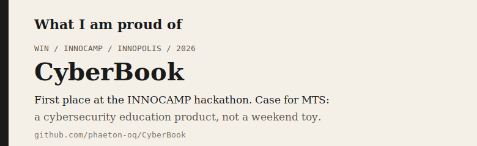
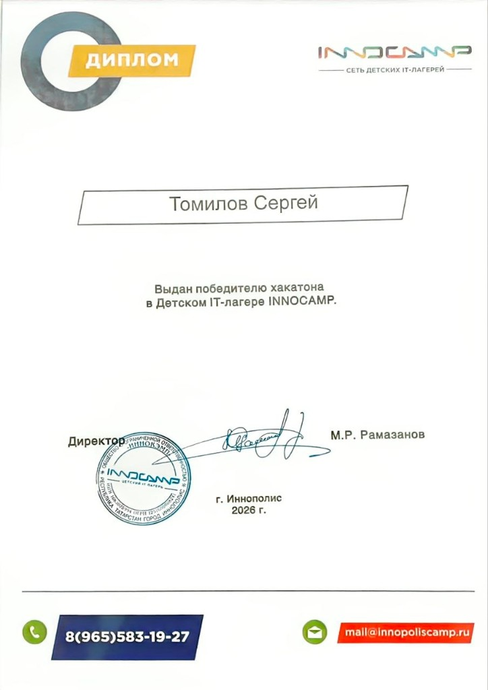

<table>
  <tr>
    <td width="72%" valign="middle">
      
    </td>
    <td width="28%" valign="middle" align="center">
      
    </td>
  </tr>
</table>

  <a href="https://github.com/phaeton-oq/CyberBook">CyberBook</a>
  |
  <a href="https://github.com/phaeton-oq/PandaBook">PandaBook</a>

